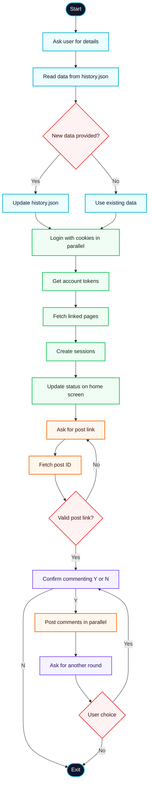

# Facebook Comment Bot ⚡

> [!WARNING]
> This project is created **for educational purposes only**.
> It is intended solely for **learning and demonstration**, to help beginners understand how tools and API calls work.
>
> **Do not use this project for any illegal, unethical, or malicious activity.**
> The developer is **not responsible** for any misuse or for issues that may arise from interactions with official authorities.


Lightning-fast Facebook comment bot with parallel processing and pre-login system fully capable to handle more than 50,000 facebook accounts ( Assumption ) parlelly and post comments through them parlelly. usefull for quick learning api calls, json structures, parsing, web scraping, automation workflows
___

## Features
- Cross plateform Cmpatability (windows, linux etc...)
- Pre-login all sessions at startup
- Lightning-fast parallel commenting
- Multi-account support
- Auto-fallback methods (Graph API + Web GraphQL)
- Real-time progress tracking
- Configurable parallelism
- fully Customizable
- user friendly terminal layout

## Tech Stack
usage multiple external and internal libraries for different kind of stuffs some of these are -

`Requests`: an library for making http requests to gain useful information about new updates and other security stuffs.

`art`: another python library used for generating text to ASCII ART

`cuncurrent.futures`: one more python module used for concurrency and parllel execution for fastest results.

___

## Insallation and Usage
just copy paste the bellow provided shell commands and wait and watch

### Windows
 - <a href="#"> Click </a> To download exec File
 - just double click on downloaded file and wait for startup
   
### Termux (Debain/linux)

```sh
pkg install python -y
pkg install git -y
git clone https://github.com/hackesofice/Facebook-Automation-2.0.git
cd Facebook-Automation-2.0
pip install -r requirements.txt
python main.py
```

### Alpine Linux
```sh
apk add python3 -y
apk add py3-pip -y
apk add git -y
git clone https://github.com/hackesofice/Facebook-Automation-2.0.git
cd Facebook-Automation-2.0
pip install -r requirements.txt
python main.py
```

___

## Customizations
the too is flexible and can be modified as user needs hear are some ideas

| Question                    | Answer | Steps                                                                                           |
|-----------------------------|--------|-------------------------------------------------------------------------------------------------|
| Can i Edit Logo             | Yes    | `essensials/settings.json` => logo => main => write your preferd name ( keep short max 4 char ) |
| Can i change Font Style     | Yes    | `essensials/settings.json` => logo => font => write `random` or preferd one from `all_fonts.txt`|
| Can i change/Color          | Yes    | `essensials/settings.json` => logo => color => write `random` or pick preferd one from `essensials/color.json` |
| Can i missuse it            | No     | its against facebook's terms of conditions youll get banned from using facebook, facebook's automation detection system may bock you from using their plateform |

___
## WorkFlow

